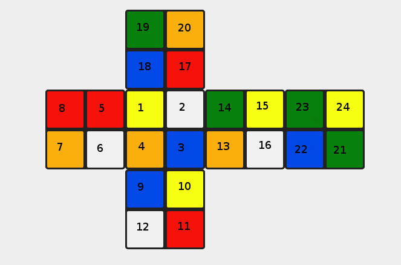
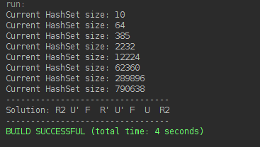

# 2x2-rubiks

2x2 Rubiks Cube Solving Algorithm in Java (Personal Project)

---------------How to use------------------------

Inside the Main.java file there's a line that says:

  String stateToBeSolved = \"wogybgryowgbowywbrogyrrb\"

Change that input string to whatever your cube looks like by following this rule:

Green is "g"
White is "w"
and so on...

The top side is the side containg (1,2,3,4), the front side is the side containing(9,10,11,12)

So the input string from the image above would be:

"ywborworbyrwogywrbgogbgy"

After that Compile&Run and the solution should pop up in a few seconds!

Output for the cube state from the image above:

